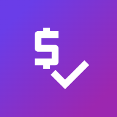

# 🧑‍🤝‍🧑 SplitMates

[](https://web.dev/progressive-web-apps/)
[](#idiomas--languages)
[](LICENSE)

<div align="center">
  
  <h3>Divide gastos fácil entre amigos. Simple, moderno y offline.</h3>
</div>

---

## 📱 Descripción

**SplitMates** es una app web progresiva (PWA) para dividir gastos en grupo, ideal para viajes, reuniones, cenas o cualquier juntada. Podés gestionar múltiples grupos, sumar participantes con emoji personalizado, añadir gastos, ver balances, gráficos, y todo funciona ¡sin conexión!  
**Multi-idioma y lista para usar desde cualquier dispositivo.**

---

## ✨ Características

- ⚡ **Rápida, intuitiva y 100% offline** (funciona como app en iOS/Android).
- 👥 **Multi-grupo y multi-idioma** (7 idiomas con selector elegante).
- 🧑‍🤝‍🧑 Participantes con nombre y emoji + color único.
- 💸 Gastos ilimitados por grupo, con historial.
- 📊 Gráficos automáticos de distribución de gastos.
- 🔄 Cálculo automático de transferencias.
- 🌗 Modo claro/oscuro elegante.
- 🏆 Animaciones y feedback visual (confetti si todos pagan igual).
- 🔒 Tus datos quedan **en tu dispositivo** (privacidad total, sin cuentas ni nube).

---

## 📥 Instalación

### **Como usuario**
1. Ingresá a la web.
2. Tocá el ícono de menú o compartir en tu navegador.
3. Elegí “Agregar a pantalla de inicio” (Android/iOS).

### **Como desarrollador**

```bash
git clone https://github.com/TowaCAI/SplitMates.git
cd SplitMates
# Si querés hacer cambios, podés abrir index.html en tu navegador
````

---

## 🛠️ Cómo usar

1. Elegí o creá un grupo (“Nuevo grupo”).
2. Agregá a todos los participantes (podés poner emoji personalizado).
3. Sumá los gastos, eligiendo quién pagó cada uno.
4. Tocá “Calcular división” para ver balances, gráficos y transferencias sugeridas.
5. ¡Listo! Podés exportar, reiniciar, o crear nuevos grupos cuando quieras.

---

## 🌍 Idiomas / Languages

* 🇦🇷 Español
* 🇺🇸 English
* 🇫🇷 Français
* 🇧🇷 Português
* 🇮🇹 Italiano
* 🇩🇪 Deutsch
* 🇷🇺 Русский

---

## 🧩 Tecnologías y dependencias

* **HTML5**, **CSS3** (responsive, modo oscuro)
* **JavaScript ES6+**
* [Chart.js](https://www.chartjs.org/) para gráficos
* Service Worker para uso offline (PWA)
* Multi-grupo y traducción pura en JS

---

## 🏗️ Estructura de Carpetas

```
splitmates/
├── assets/            # Iconos, favicons, imágenes
├── scripts/           # JS principal (app.js, modules.js, i18n.js)
├── styles/            # main.css
├── index.html
├── manifest.json
├── service-worker.js
```

---

## 🔐 Privacidad

* Todos los datos se guardan **solo en tu navegador/localStorage**.
* No se comparte nada con terceros.
* No requiere registro, login ni conexión a servidores.

---

## 🙏 Créditos

* Desarrollado por [TowaCAI](https://github.com/TowaCAI)
* Librerías:

  * [Chart.js](https://www.chartjs.org/)
  * [Google Fonts: Montserrat](https://fonts.google.com/specimen/Montserrat)

---

## 💡 Colaborar o feedback

¿Tenés ideas, querés traducir a otro idioma o encontraste un bug?
¡Abrí un issue, hacé un fork o contactame por GitHub!

---

## 📄 License

This project is licensed under the MIT License - see the [LICENSE](LICENSE) file for details.

---

## 🇬🇧 ENGLISH (Short)

**SplitMates** is a modern, offline-first app to split expenses among friends, with support for multiple groups, customizable participants, charts, and automatic suggestions for who should pay whom.
Works 100% offline, with 7 languages and a beautiful dark mode.
Data stays in your browser—no accounts or cloud needed!

---

> 💡 *Made with love by TowaCAI*
